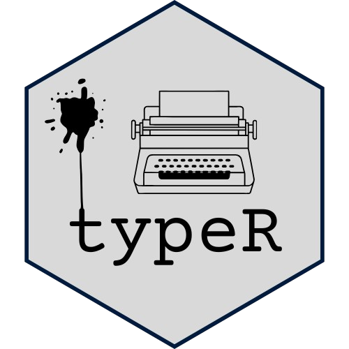

# typeR <a href='https://Fgazzelloni.github.io/typeR/'></a>

<!-- badges: start -->
[](https://github.com/Fgazzelloni/typeR/actions/workflows/R-CMD-check.yaml)


[](https://CRAN.R-project.org/package=typeR)
[](https://CRAN.R-project.org/package=typeR)
<!-- badges: end -->

`typeR` is an R package that simulates typing effects on R script files, making it ideal for live coding presentations, interactive teaching, or creating animations. It supports **R scripts**, **R Markdown**, and **Quarto presentations** (including reveal.js slides).

## Installation

```R
# Install from CRAN
install.packages("typeR")

# Or get development version

# Install devtools if you don't already have it
install.packages("devtools")

devtools::install_github("Fgazzelloni/typeR")
```

## Usage

### Basic R Scripts

Here's an example of how to use the `typeR` package:

```R
library(typeR)

# Create a test script for demonstration
writeLines(c(
  "# Testing typeR",
  "x <- 1:10",
  "y <- x*2",
  "plot(x, y)"
), "test_script.R")

# Simulate typing the script (display only)
typeR("test_script.R", delay = 0.05)

# Type AND execute the code
typeRun("test_script.R", delay = 0.05)
```

### Quarto Presentations

Perfect for live coding in presentations! Works seamlessly with Quarto reveal.js slides:

```R
# Use the included example presentation
demo_file <- system.file("examples/demo-presentation.qmd", package = "typeR")
typeRun(demo_file)

# Or create your own Quarto presentation
typeRun("my-presentation.qmd", delay = 0.08, max_print = 5)
```

See the [Quarto Presentations vignette](https://fgazzelloni.github.io/typeR/articles/quarto-presentations.html) for detailed examples and best practices.

## Features

- **Typing Animation**: Simulates realistic typing of R code character by character
- **Live Execution**: `typeRun()` executes code in real-time as it types
- **Multiple Formats**: Supports `.R`, `.Rmd`, and `.qmd` (Quarto) files
- **Quarto Presentations**: Perfect for reveal.js slides and other Quarto formats
- **Interactive Control**: Press ESC to pause, then resume or stop
- **Smart Output**: Handles plots, models, and long outputs intelligently
- **Customizable Speed**: Adjust `delay` and `jitter` for natural typing rhythm
- **Teaching-Friendly**: Ideal for courses, workshops, and conference presentations

## Contributing

Contributions are welcome! Please open an issue or submit a pull request.

## License

This package is licensed under the MIT License. See the [LICENSE](./LICENSE) file for details.
