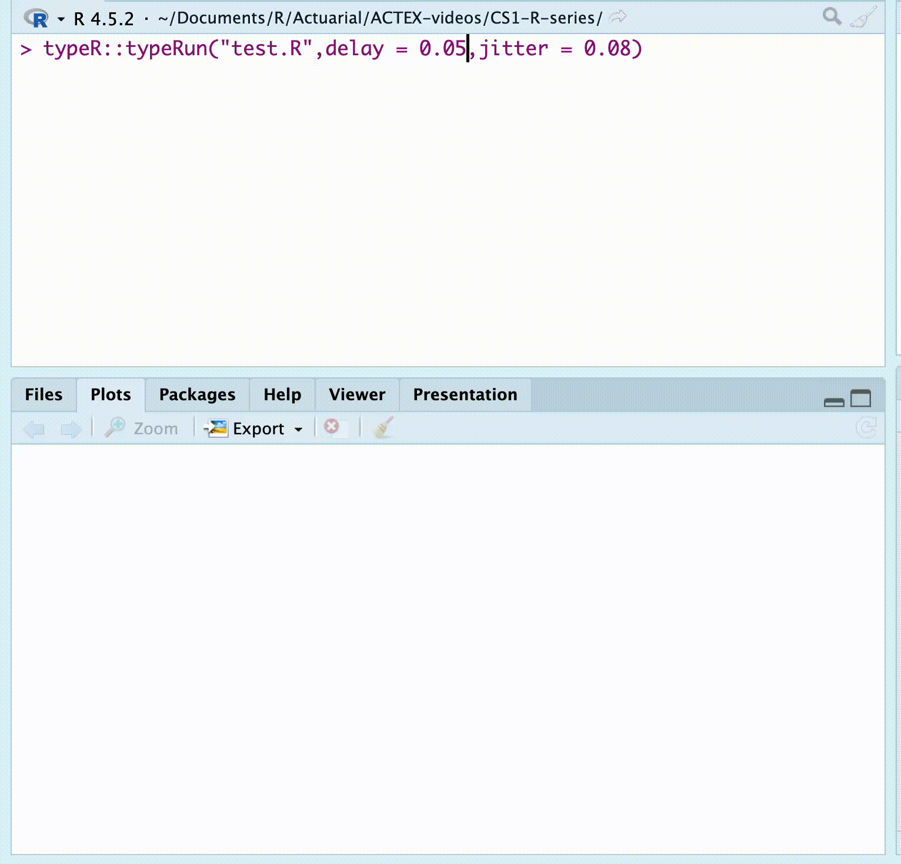

# Live Code Execution with typeRun

``` r
library(typeR)
```

## Introduction

[`typeRun()`](https://Fgazzelloni.github.io/typeR/reference/typeRun.md)
is an enhanced version of
[`typeR()`](https://Fgazzelloni.github.io/typeR/reference/typeR.md) that
not only simulates typing animation but also **executes your R code in
real-time**. This makes it perfect for:

- 🎓 Live teaching and workshops
- 🎤 Conference presentations
- 📹 Recording tutorials
- 🧪 Interactive demonstrations

## Basic Usage

### Simple Script Execution

The most basic usage is to run an R script with typing animation and
live execution:

``` r
# Create a simple script
cat("# Data Analysis Demo
x <- 1:10
mean(x)
sum(x)
", file = "demo.R")

# Type and execute it
typeRun("demo.R")
```

**What you’ll see:** - Code types out character by character - Each line
executes as it’s typed - Results appear immediately after each command



typeR::typeRun demo

### Comparison: typeR vs typeRun

``` r
# typeR: Just displays, doesn't execute
typeR("demo.R")
# Output: Shows the code typing out (no results)

# typeRun: Types AND executes
typeRun("demo.R")
# Output: Shows code typing + execution results
```

## Customizing the Experience

### Control Typing Speed

``` r
# Slower typing for dramatic effect
typeRun("demo.R", delay = 0.1, jitter = 0.02)

# Faster typing for quick demos
typeRun("demo.R", delay = 0.02, jitter = 0.005)
```

**Parameters:** - `delay`: Base time between characters (seconds) -
`jitter`: Random variation for natural feel

### Limit Output Length

For long outputs, control how much is displayed:

``` r
cat("
# Long vector
long_vec <- 1:1000
long_vec

# Large data frame
big_df <- mtcars[rep(1:32, 10), ]
big_df
", file = "long_output.R")

# Show only first 5 elements/rows
typeRun("long_output.R", max_print = 5)
```

## Working with Models

### Linear Models

``` r
cat("
# Linear regression
model <- lm(mpg ~ hp + wt, data = mtcars)
summary(model)
", file = "model_demo.R")

typeRun("model_demo.R")
```

**What happens:**

- `model <- lm(...)` executes silently (no output)
- `summary(model)` displays the full summary with coefficients,
  R-squared, etc.

### GLM and Other Models

[`typeRun()`](https://Fgazzelloni.github.io/typeR/reference/typeRun.md)
handles all model types intelligently:

``` r
cat("
# Logistic regression
glm_model <- glm(am ~ hp + wt, data = mtcars, family = binomial)
summary(glm_model)

# Poisson regression
pois_model <- glm(carb ~ mpg, data = mtcars, family = poisson)
summary(pois_model)
", file = "glm_demo.R")

typeRun("glm_demo.R")
```

### Statistical Tests

The
[`typeRun()`](https://Fgazzelloni.github.io/typeR/reference/typeRun.md)
function properly displays statistical test results using their
formatted print methods:

``` r
library(typeR)

# Create a test script
cat('x <- rnorm(50, mean = 20, sd = 3)
tt <- t.test(x, alternative = "two.sided", conf.level = 0.95)
tt
', file = "test_ttest.R")

# Run it
typeRun("test_ttest.R", delay = 0.01)
```

This will display the t-test results in their proper formatted output:

        One Sample t-test

    data:  x
    t = 45.185, df = 49, p-value < 2.2e-16
    alternative hypothesis: true mean is not equal to 0
    95 percent confidence interval:
     18.68753 20.42711
    sample estimates:
    mean of x 
     19.55732

The same applies to other statistical objects like
[`anova()`](https://rdrr.io/r/stats/anova.html),
[`aov()`](https://rdrr.io/r/stats/aov.html),
[`lm()`](https://rdrr.io/r/stats/lm.html), etc.

## Interactive Control

### Pause and Resume

During execution, you have full control:

1.  **Press ESC** (or Ctrl+C) to pause
2.  You’ll see: `Enter choice (1 resume or 2 stop):`
3.  **Enter 1** to continue from where you paused
4.  **Enter 2** to stop completely

``` r
typeRun("long_script.R")
# Press ESC while running
# Enter 1 to resume
# Or enter 2 to stop
```

This is perfect for: - Answering questions during presentations -
Explaining specific code sections - Debugging during demonstrations

## Working with R Markdown and Quarto

### R Markdown Files

[`typeRun()`](https://Fgazzelloni.github.io/typeR/reference/typeRun.md)
intelligently handles `.Rmd` files:

``` r
# Create an R Markdown example
typeRun("report.Rmd")
```

**Behavior:** - ✅ Types and shows all text - ✅ Executes only R code
chunks - ✅ Skips YAML headers - ✅ Preserves narrative flow

### Quarto Documents

Works identically with `.qmd` files:

``` r
typeRun("analysis.qmd")
```

## Advanced Features

### Custom Evaluation Environment

Run code in an isolated environment to keep your workspace clean:

``` r
# Create custom environment
my_env <- new.env()

# Run in that environment
typeRun("demo.R", envir = my_env)

# Check what was created
ls(my_env)
ls()  # Your global environment is unchanged
```

### Suppressing Library Messages

Package loading messages are automatically suppressed:

``` r
cat("
library(ggplot2)  # No startup message shown
library(dplyr)    # Clean output

# But code works normally
mtcars %>% head()
", file = "packages.R")

typeRun("packages.R")
# Shows only the actual results, not package messages
```

------------------------------------------------------------------------

## Output Handling Details

### What Executes Silently

These don’t produce output (cleaner demos):

``` r
cat("
# Assignments - silent
x <- 1:10
y <- mean(x)

# Plots - execute but don't clutter console
plot(x, y)
hist(x)

# Package loading - no startup messages
library(stats)
", file = "silent.R")

typeRun("silent.R")
```

### What Shows Output

``` r
cat("
# Direct values
1:10          # Shows the vector

# Function calls
mean(1:10)    # Shows: [1] 5.5

# Print statements
print('Hello') # Shows: [1] 'Hello'

# Model summaries
summary(lm(mpg ~ hp, data = mtcars))  # Shows full summary
", file = "visible.R")

typeRun("visible.R")
```

------------------------------------------------------------------------

## Practical Examples

### Teaching Linear Regression

``` r
cat("
# Load data
data(mtcars)
head(mtcars, 3)

# Visualize relationship
plot(mtcars$hp, mtcars$mpg,
     xlab = 'Horsepower',
     ylab = 'Miles per Gallon',
     main = 'MPG vs Horsepower')

# Fit model
model <- lm(mpg ~ hp, data = mtcars)
summary(model)

# Add regression line
abline(model, col = 'red', lwd = 2)

# Predictions
new_data <- data.frame(hp = c(100, 150, 200))
predict(model, new_data)
", file = "teaching_demo.R")

typeRun("teaching_demo.R", delay = 0.08)
```

### Data Analysis Workflow

``` r
cat("
# 1. Load and explore
data <- iris
str(data)

# 2. Summary statistics
summary(data)

# 3. Visualization
boxplot(Sepal.Length ~ Species, data = data,
        main = 'Sepal Length by Species',
        col = c('lightblue', 'lightgreen', 'pink'))

# 4. Statistical test
aov_result <- aov(Sepal.Length ~ Species, data = data)
summary(aov_result)

# 5. Post-hoc test
TukeyHSD(aov_result)
", file = "analysis_demo.R")

typeRun("analysis_demo.R", delay = 0.06, max_print = 8)
```

### GLM Demonstration

``` r
cat("
# Binary outcome: Manual transmission (am)
# Predictors: HP and weight

# Fit logistic regression
logit_model <- glm(am ~ hp + wt, 
                   data = mtcars, 
                   family = binomial(link = 'logit'))

# Model summary
summary(logit_model)

# Odds ratios
exp(coef(logit_model))

# Predicted probabilities
mtcars$pred_prob <- predict(logit_model, type = 'response')
head(mtcars[, c('am', 'hp', 'wt', 'pred_prob')])
", file = "glm_example.R")

typeRun("glm_example.R", max_print = 6)
```

------------------------------------------------------------------------

## Tips and Best Practices

### 1. Prepare Your Script

Before presenting:

``` r
# Test your script normally first
source("demo.R")

# Then test with typeRun
typeRun("demo.R")
```

### 2. Timing Considerations

``` r
# For 5-minute demos: ~0.05 delay
typeRun("demo.R", delay = 0.05)

# For dramatic reveals: ~0.1 delay
typeRun("demo.R", delay = 0.1)

# For quick reviews: ~0.02 delay
typeRun("demo.R", delay = 0.02)
```

### 3. Output Management

``` r
# Lots of output? Limit it
typeRun("demo.R", max_print = 5)

# Models in script? They'll show nicely
# Plots in script? They'll render silently
```

### 4. Keep Scripts Focused

``` r
# Good: One concept per script
typeRun("01_data_loading.R")
typeRun("02_visualization.R")
typeRun("03_modeling.R")

# Less good: One giant script
typeRun("everything.R")  # Too long, hard to control
```

------------------------------------------------------------------------

## Troubleshooting

### Script Not Found

``` r
# Error: The file does not exist
typeRun("missing.R")

# Solution: Check file path
file.exists("demo.R")
list.files(pattern = "\\.R$")
```

### Unexpected Output

``` r
# If output looks wrong, test the script normally first
source("demo.R")

# Then try with typeRun
typeRun("demo.R")
```

### Want to Stop Mid-Execution

``` r
# Press ESC, then enter 2
# Or press Ctrl+C (on some systems)
```

------------------------------------------------------------------------

## Comparison Table

| Feature                     | [`typeR()`](https://Fgazzelloni.github.io/typeR/reference/typeR.md) | [`typeRun()`](https://Fgazzelloni.github.io/typeR/reference/typeRun.md) |
|-----------------------------|---------------------------------------------------------------------|-------------------------------------------------------------------------|
| Typing animation            | ✅                                                                  | ✅                                                                      |
| Code execution              | ❌                                                                  | ✅                                                                      |
| Shows output                | ❌                                                                  | ✅                                                                      |
| Interactive pause/resume    | ❌                                                                  | ✅                                                                      |
| Output truncation           | ❌                                                                  | ✅                                                                      |
| Custom environment          | ❌                                                                  | ✅                                                                      |
| Model summary handling      | N/A                                                                 | ✅                                                                      |
| Library message suppression | N/A                                                                 | ✅                                                                      |

------------------------------------------------------------------------

## See Also

- [`?typeR`](https://Fgazzelloni.github.io/typeR/reference/typeR.md) -
  Basic typing animation without execution
- [`?typeRun`](https://Fgazzelloni.github.io/typeR/reference/typeRun.md) -
  Full function documentation
- [Package website](https://Fgazzelloni.github.io/typeR/)

------------------------------------------------------------------------
